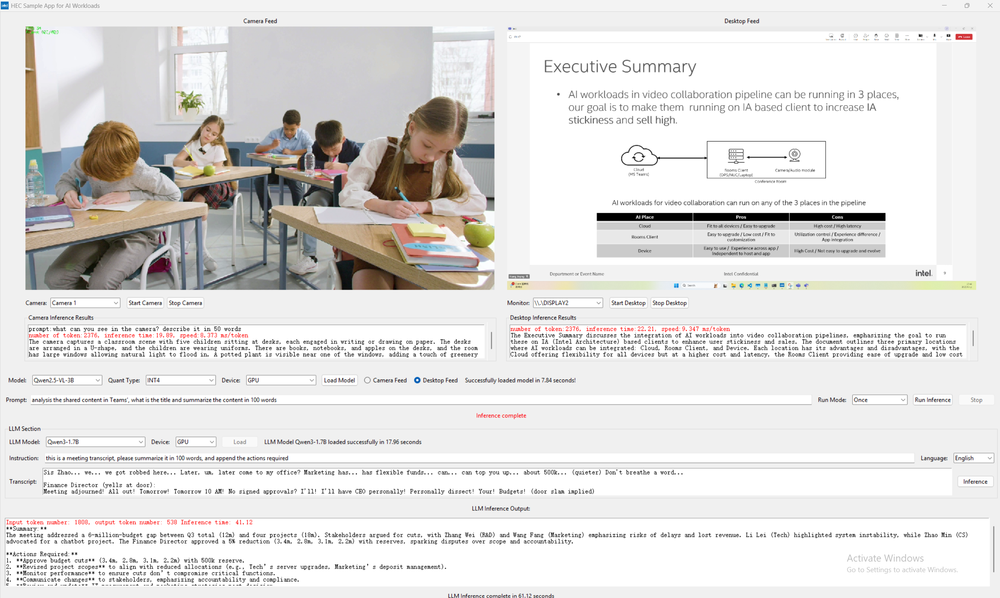

# Multi-Modal AI Sample Application for Video Collaboration

A comprehensive sample application with camera and desktop video feeds VLM analysis, LLM-based meeting and class transcription analysis and summarization, as well as integration of MCP tools take the required actions based on the meeting transcript, such as action item generation, meeting minutes summarization, and action item prioritization. It can also integrates a virtual camera with features like auto framing, emotion recognition based on pipeline of multiple traditional CV algorithms. This sample application features supported by the latest multi-modal AI is optimized on Intel Core Ultra platform.


This sample application can be used as a tool to simulate end to end multiple vertical use cases, now video collaboration use case focused, other vercial use cases can also leverage this tool because that's more about models selection and prompt engineering.The application.




## Performance Results
| Metric             | ADL-225H   | MTL-125H   |
| ------------------ | ---------- | ---------- |
| Qwen2.5-VL-3B-int4 | 3ms/token  | 6.4ms/token|
| Qwen3-1.7B         | 15ms/token | 20ms/token |


## Use Cases

### 1. A tool to simulate end to end workload with multiple AI features to evaluate their performance and accuracy in real use cases.

- The tool supports to load different models and quantization settings, and key performance metrics along with inferencing result.

### 2. A tool to test various models and to do prompt engineering for vertical use cases.
- It supports to load different size and quantization models, vertical customer facing engineer or customer can use it to test different models, to write vertical use case relevant prompts and validate the result directly in the tool.

### 3. A reference implementation for application development.
- The pipeline design and application level optimization can be referred by ISVs during their application development.


## Features

### Video Processing
- Qwen3 VLMs inferencing support for both camera feeds and desktop sharing feeds
- Qwen3 LLM inferencing support for meeting transcript summarization
- Real-time face and person detection using OpenVINO optimized traditional CV models
- Emotion recognition with 5 different emotion categories
- Auto Framing and emotion recognition features in virtual camera
- Multiple desktop screen capture and VLM analysis on captured video
- Multiple camera selection and VLM analysis on captured video
- Video file, camera and desktop capturing input support

### Optimized Performance
**- Keep High responsiveness in applications (Explorer, Offices, VS code) and full speed 4k30FPS video replaying while simutanously inferencing three traditional CV and one VLM/LLM models, plus camera and desktop video feeds displaying**
- Optimized application startup
- Lazy and asynchronous model loading
- Threading for UI responsiveness
- FPS control for video output
- Efficient frame capturing and buffering for video analysis
- Smart desktop content change detection

### User Interface
- Dual-display interface for camera and desktop feeds
- Multiple camera and display support
- Configurable model selection and settings
- Meeting transcription and summary by using latest Qwen3 LLM model
- Continuous VLM inference mode with 20-second (configurable) intervals for either camera feeds or desktop feeds
- Progress indicators and status updates
- Inferencing and model loading KPIs in result.


## Installation

1. Download MiniConda and install it
2. Download OBS and enable virutal camera in it if you like to run vcam.py alongwith AI4VideoCollab

3. Copy the application folder to a desired location, say <App_Dir>.

4. Create a conda environment for the application, for example AI4VideoCollab, run pip install -r requirement.txt to install all dependencies.

5. Create a subfolder 'models' in <App_dir>, Download required models:
   - Place face detection models in `<App_dir>/models/cv/face-detection-retail-0004/`
   - Place emotion recognition models in `<App_dir>/models/cv/emotions-recognition-retail-0003/`
   - Place VLM models in `<App_dir>/models/vlm/` [Validted models: Qwen2.5-VL-3B-Int4, Qwen2.5-VL-7B-Int4]
   - Place LLM models in `<App_dir>/models/llm/` [Validated models: Qwen3-1.7B]

## Usage

### Running the Main Application
```powershell
conda activate AI4VideoCollab
pip install -r requirements.txt
python SimulatorStarter.py
```

### Running Virtual Camera together with the Main application
```powershell
# With webcam input
conda activate AI4VideoCollab
python vcam.py
python SimulatorStarter.py
```

## Prerequisites

### Hardware Requirements
- Intel CPU with OpenVINO support
- Webcam (for camera input)

### Software Requirements
```
numpy>=1.20.0
Pillow>=9.0.0
opencv-python>=4.5.0
pywin32>=228
torch>=2.0.0
transformers>=4.30.0
optimum-intel>=1.12.0
openvino>=2023.1.0
modelscope>=1.9.5
pyvirtualcam>=0.10.0
```

## Application Components

### 1. Main Application 
- Provides main GUI interface
- Implements VLM and LLM processing
- Handles desktop capture and camera inputs
- Manages model loading and inference

### 2. Virtual Camera Module (vcam.py)
- Implements virtual camera functionality
- Handles face detection and emotion recognition
- Supports both webcam and video file inputs
- Maintains steady 30 FPS output


## License

GNU GPL V3

